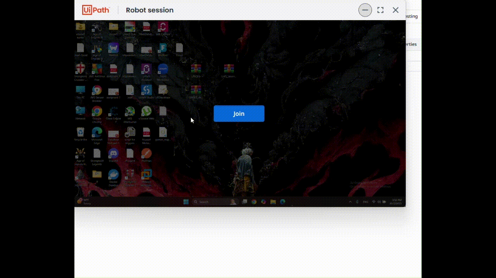
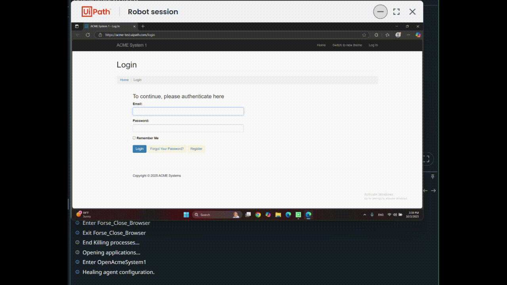

## RAYA - Generate Yearly Report

This project automates the yearly report generation process using UiPath Robotic Enterprise Framework (REF). It consists of two main components:

- **Dipatcher**: Responsible for collecting and uploading transaction data to the Orchestrator queue.
- **Performer**: Processes each transaction item, downloads monthly reports, merges data, and uploads the final yearly report.

### Packages Used

Both Dipatcher and Performer use the following UiPath packages:

- UiPath.Excel.Activities
- UiPath.System.Activities
- UiPath.UIAutomation.Activities
- UiPath.Testing.Activities
- DriveActivities

### Process Overview

#### Dipatcher
1. **Main.xaml**: Entry point, initializes settings and applications.
2. **PopulateTransactionAndUploadData.xaml**: Navigates to the Work Items page, extracts work items, and uploads them to the Orchestrator queue.
	- Uses workflows: `NavigateToWorkItemsPage.xaml`, `ExtractWorkItemsData.xaml`.

#### Performer
1. **Main.xaml**: Entry point, initializes settings and applications.
2. **ContolStateOfSystems.xaml**: Ensures required systems are in the correct state before processing.
3. **ProcessWorkFlow.xaml / Process.xaml**: Processes each transaction item:
	- Navigates to download monthly reports
	- Merges reports
	- Uploads the final yearly report

### Documentation

See `RAYA-REF-Generate-Yearly-Report_Dipatcher/Documentation/REFramework Documentation-EN.pdf` for details on the framework.

### Process Videos

- Dipatcher process: 
- Performer process: 

---
For any configuration, refer to the `Config.xlsx` file in the `Data` folder of each project.
